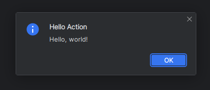

# Hello Plugin

This is a simple plugin that adds a new action to the Search Everywhere group. The action is named "Hello Dialog Action"
and when performed displays a modal dialog window with a "Hello, world!" text and an "OK" button.



This repository also contains ready-to-install archive with the plugin: `actionPlugin-1.0.zip`. To install it in your
IDE, please go to the `Settings -> Plugins` and choose "Install Plugin from disk" option under the cog.

Alternatively, you can run a test instance of IDEA with the plugin installed by running the following command in your
terminal:

```bash
./gradlew runIde
```
